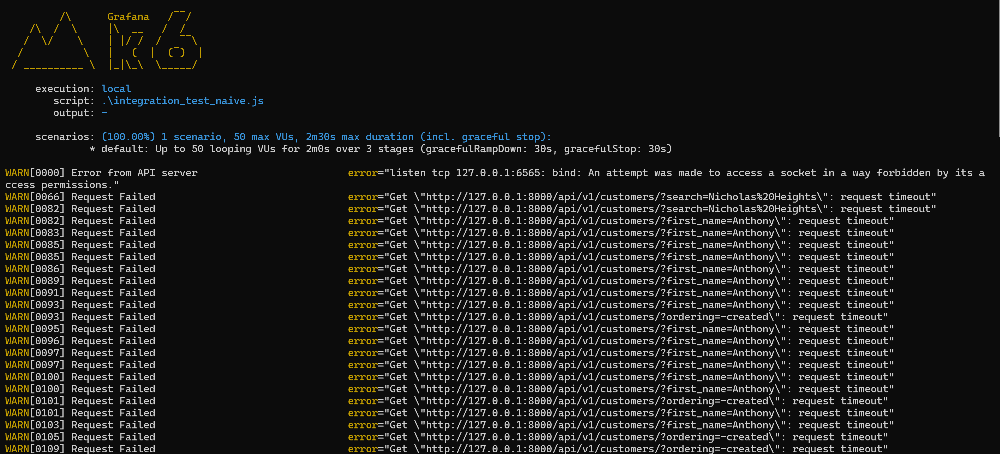

# django-optimized-vs-naive-benchmark

Compare a **naive synchronous** Django API with an **optimized asynchronous** Django API under identical workloads.  
The domain of both implementation and their endpoints are the same and differences are about the design and performance optimization.

---

## Overview

This repository demonstrates how design choices affect **throughput**, **latency**, and **scalability** in Django:

- **Naive (Synchronous):** popular Django + DRF, easy to read and extend and use popular and common libraries
- **Optimized (Asynchronous):** domain-driven design (DDD), async views, Redis caching, keyset pagination, and query optimization, and database capabaility (Using FTS of PostgreSql)

Both implementations target the same features in order to benchmarking capability with **k6**, **pytest-benchmark**, and integration tests.

---

## Repository Layout

```
.
├─ naive/                 # DRF-based, synchronous implementation (baseline)
│  ├─ DockerFile
│  ├─ compose.yml
│  ├─ .env
│  ├─ .env.dev
│  ├─ load_test.js
│  └─ ...
├─ optimized/            # django-ninja-based, asynchronous implementation (DDD)
│  ├─ DockerFile
│  ├─ compose.yml
│  ├─ .env
│  ├─ .env.dev
│  ├─ load_test.js
│  └─ ...
└─ media/                       # benchmark results: results screenshots
```

---

## Tech Stack

**Naive (Sync)**
- Django
- **Django REST Framework (DRF)** (Powerful RestFul API tookit for building django APIs, serialization, viewsets, routres, pagination and much more features)
- drf-spectacular (OpenAPI Swagger)
- DRF filters for (search/ordering)
- gunicorn (WSGI)

**Optimized (Async)**
- Django
- **django-ninja** (async web framework for building APIs with django, pydantic data validation and management, pagination, filtering, Built-in OpenAPI Swagger, )
- django-ninja-extra (dependency injection, async permissions, CBVs)
- pydantic
- **django-async-redis** (Redis caching)
- kink (DI container)
- **uvicorn** (ASGI)

**Common**
- PostgreSQL (Database)
- psycopg3 (PostgreSQL sync & async with session pool capabality)
- Docker / Docker Compose
- **k6** (load), **pytest** (integration), **pytest-benchmark** (micro-bench)

---

## Design & Approach

- **Naive (Sync):** Baseline aligned with Django docs—straightforward `models / views / serializers`. Uses DRF for filtering, search, ordering, and pagination.
- **Optimized (Async):** Domain Driven Design (DDD)-inspired boundaries for testability and maintainability. Async endpoints via django-ninja and targeted performance improvements:

  - **ASGI + async views** for high I/O concurrency
  - **Query Optimization**: `select_related` / `prefetch_related` to avoid N+1
  - **Focused DB indexing** on commonn filter/sort fields
  - **Cursor (keyset) pagination** to avoid expensive `COUNT(*)`
  - **PostgreSQL FTS** with `SearchVector` for weighted text search by Postgresql Text Search Engine
  - **Redis caching** with signal-based invalidation on create/update/delete for most common queries

---

## Prerequisites

- Docker & Docker Compose
- (Optional) Python 3.11+ for local (non-Docker) runs
- (Optional) k6 for load tests: https://k6.io/docs/get-started/installation/

---

## Quick Start (Docker)

Run each implementation independently. For side-by-side comparison, map them to different ports.

### Naive (sync)

```bash
cd naive
cp .env .env
# (optional) change port mappings in docker-compose.yml if 8001 is taken
docker compose up --build -d
```

### Optimized (async)

```bash
cd optimized
cp .env .env
# (optional) change port mappings (e.g., 8000)
docker compose up --build -d
---

## Generate Test Data (3M records)

Both apps include a management command (Faker) to seed the database.

```bash
#  Replace `<app_container>` with the container name from `docker ps

docker exec -it <app_container>   python manage.py generate_fake_data --customers 3_000_000 --worker 4
```

**Tip:** If resources are limited, start smaller: `--customers 300_000`.

---

## Endpoints & API Docs

- **Naive (sync):**
  - App: `http://127.0.0.1:8001/`
  - Docs: `http://127.0.0.1:8001/api/swagger`

- **Optimized (async):**
  - App: `http://127.0.0.1:8000/` *(or your configured port)*
  - Docs: `http://127.0.0.1:8000/api/swagger`

---

## Tests & Benchmarks

**Integration tests**

```bash
docker exec -it <app_container> pytest -q
```


**Micro-benchmarks**

```bash
docker exec -it <app_container> pytest -q tests --benchmark-only
```


**Load & stress with k6**

```bash
# run from within each project folder
k6 run load_test.js
```

Compare **RPS**, **p95 latency**, **error rate**, and **throughput** across both implementations.  

#### Naive




#### Optimized


---

## Configuration

Each project ships a `.env`. Copy and adjust:

```dotenv
# security
SECURE_SSL_REDIRECT=False
SESSION_COOKIE_SECURE=False
CSRF_COOKIE_SECURE=False

# Common
POSTGRES_DB=app
POSTGRES_USER=app
POSTGRES_PASSWORD=app
POSTGRES_HOST=db
POSTGRES_PORT=5432

# Django
DEBUG=False
DJANGO_SECRET_KEY=change-me
LOG_LEVEL=INFO
ALLOWED_HOSTS='localhost, 127.0.0.1'

# Cache (optimized only)
REDIS_URL=redis://redis:6379/0
CACHE_LOCATION=redis://redis:6379/0
CACHE_TIMEOUT=300

```

**Dev cache maintenance**  
If using a Redis container:

```bash
docker exec -it <redis_container> redis-cli FLUSHALL
```

---

## Troubleshooting

- **Port in use:** Change `APP_PORT` in `.env` or `ports` in `docker-compose.yml`.
- **Memory pressure on 3M rows:** Seed fewer records, allocate more RAM/CPU to Docker, or tune Postgres shared buffers.
- **k6 missing:** Install locally or run via container:
  ```bash
  docker run --rm -i grafana/k6 run - < load_test.js
  ```
- **DB connection errors:** Verify `POSTGRES_*` variables; ensure DB container is healthy and app waits for DB.

---

## Why this project?

- Provide a **clear, reproducible comparison** between a conventional DRF app and an optimized async/DDD design.
- Offer **drop-in patterns** (keyset pagination, FTS, caching, query tuning) for real projects.
- Show **measurable impact** using synthetic 3M-row datasets and standard tooling.

---

## License

MIT (see `LICENSE`).


