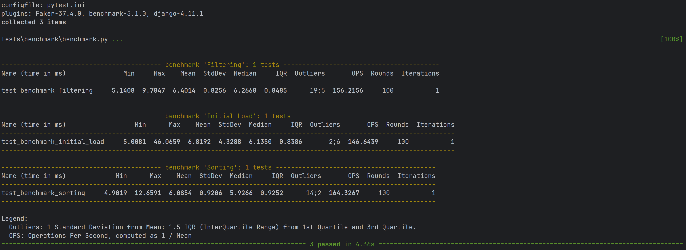

# Optimized Django Backend 

In order to show difference between performance and optimization on django project for scalable usage, I tried to have two different implementations.

<ol>
    <li>
        <h4>Naive implementation (Synchronous):</h3>
        <p>
            This is synchronous, robust, django MVC structure, and simple implementation by using the following 
            packages without any optimization.
        </p>
        <ul style="type⚫">
            <li>django rest framework (DRF)</li>
            <li>django rest framework (DRF)</li>
            <li>drf-spectacular (OpenAPI documentation for DRF)</li>
            <li>psycopg (psycopg 3)</li>
            <li>DRF Filter, search, ordering</li>
            <li>gunicorn</li>
        </ul>
    </li>
    <li>
        <h4>Optimized implementation (Asynchronous):</h3>
        <p>
            The second implementation is an asynchronous application which is based on domain driven design.<br>
            I tried to optimize this implementation and the following packages are used in this implementation.
        </p>
        <ul style="type⚫">
            <li>django ninja (Async view, paginator, filtering and OpenAPI documentation)</li>
            <li>django ninja extra (Dependency injection, async permission, class-based view)</li>
            <li>django ninja filtering</li>
            <li>pydantic</li>
            <li>django async redis (for redis caching)</li>
            <li>kink (for dependency injection)</li>
            <li>psycopg (psycopg 3)</li>
            <li>uvicorn</li>
        </ul>
    </li>
</ol>

---

# Implementation

I use postgresql as my main database in this project and use psycopg 3 library for connect to db. It supports both sync and async implementation.

## Naive
For the naive implementation, I don't use any optimization. I just use database and django rest framework to achieve
and show data model and expected behaviour in the naivest and simple way.
I use DRF capabilities like ordering, filtering, and search, and paginator to
do our expected behaviour.

I use the django base structure for this project and try to do everythings close to django
documentations.

## Optimized
In the second implementation, Use domain driven design (ddd) approach to have clean architecture 
for further development and become close to business domain language and more testable and separate architectural concerns 

In order to get the better performance based on our expectations, I use the following
approaches to get the better performance to serve in a scalable environment.


---

## Key Optimizations

### 1. Asynchronous Request Handling
In order to handle heavy and high number of request at the lowest time, I use django async 
capabilities alongside using django ninja for controllers and async pagination.
Also, I use uvicorn to serve application by ASGI instead of WSGI.

### 2. Query Optimization
The **`select_related`** method is used to fetch related objects in a single database query.
Use search_related for two foreign keys and enhance request and prevent n+1 queries by using left and inner join.

###  3. Database Indexing
Use database indexing to improve retrieve frequently query fields.
Also add related fields to improve the query performance. Although this can create overhead for writing 
operation.

### 4. Cursor-Based Pagination
Remove the extensive counts on large dataset queryset and pagination and instead I use cursor base pagination.
This is kind of customized pagination and just show next or previous if applicable and the current data sets.
Use special strategy for pagination and prevent to expensive cost COUNT(*) query of my queryset and just show next and before page 
token similar to twitter

### 5. PostgreSQL Full-Text Search Capability (FTS)
To enhance search performance, PostgreSQL's `SearchVector` is used.<br>
Use `SearchVector` capability of Postgresql to improve search speed by create weighted text and use 
Text search engine of postgresql, but it can be trade-off because it can help increase text search in a fast pace 
but create a little overhead on writing to create search vector and not fully appropriate for numerical search, 
therefore, I create customize search which integrated of SearchVector alongside query search for numerical field.

### 6. Caching
Use cache strategy by employing redis to reduce database hits for repeated queries, and because our output not be user dependent, I don’t use any kind of cache based on header or user agents, or authentication token:
- Cache data based on request
- Delete cache based on delete, update, or insert new data on database by using signals
- I use redis cache for production only and use `LocalMemCache` for dev purpose for simplicity, and it causes to use
`aclear()` for clear cache by signal, but in production-ready application, it is preferred to use wild-card pattern 
and `delete_pattern()` to prevent other keys from remove
- I choose to cache the primary keys of the requested data to reduce database queries and load and efficient memory usage but I create another async decorator for view level caching that If it is necessary we can use it but it less memory efficient but reduce database hits.
- I use a db manager to add caching strategy

---

## Performance Testing

 In order to test my codes I use three different tools based on the test purpose.

- Integration testing (by pytest) (to test behavioural functionality)
- Benchmark Testing (by Pytest-benchmark) 
- Load & Stress Testing (By Grafana K6)

### Integration Test


### Benchmark Testing



### Load & Stress Test
First, I create 3 million records by using Faker and create a django command 
based on it. This db is shared among two project.
Also, I use docker for database, also I use redis and nginx in optimized implementation.
In naive implementation, I just use nginx to serve files and as reverse proxy and PostgreSQL db.
Then use k6 for 50 users in 2 and half minutes with 3 scenario and the same endpoints of two projects.
Based on the results that show as the following:

#### Naive


#### Optimized


As the result we can see the much and higher performance of the same query and search in the optimized implementation
rather than naive one. 

## How to Run

In order to run project, there are two different folder and each one has their own docker and
docker compose file.
After enter the target project,

Run:
```shell
docker compose up --build -d

```

Then in order to generate fake customer data, each project has its own command and has
some difference between them. So then 

Run:

```shell
docker exec -it <app container name> python manage.py generate_fake_data --customers 3_000_000 --worker 4

```

and then on the following address, application ready to use.

```shell
127.0.0.1:8000
```

in order to use documentation (for both projects), you can use:

```shell
127.0.0.1:8000/api/swagger
```


Also in order to run K6 load test, you can use

```shell
k6 run load_test.js
```
